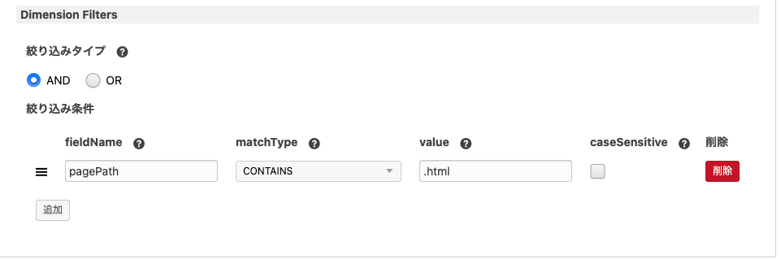

# Google Analytics 4
Google Analytics 4（GA4）と連携するための拡張アプリです。

## 動作環境
- a-blog cms: >= Ver. 3.0.0
- PHP： 7.4 ~
- BC Math （PHP Extension）

## ダウンロード

[Google Analytics 4](https://github.com/appleple/acms-google-analytics4/raw/master/build/GoogleAnalytics4.zip)

## インストール方法

拡張アプリをダウンロード後、zipファイルを解凍して `extension/plugins/`に設置します。

設置が完了すると、「管理画面 > 拡張アプリ」に`GoogleAnalytics4`という名前で拡張アプリが表示されるので、インストールをクリックしインストールします。


## 事前準備
Google Analytics 4 拡張アプリを使用して Google Analytics 4 と連携するためには Google Cloud Platform と Google Analytics 4 それぞれでいくつか準備が必要になります。

### 1. Google Cloud Platform

#### 1-1. プロジェクトの作成

[Google Cloud Platform](https://console.cloud.google.com/)からプロジェクトを作成します。作成手順は[公式のガイド](https://cloud.google.com/resource-manager/docs/creating-managing-projects?hl=ja)を参考にしてください。

#### 1-2. Google Analytics Data API を有効にする

Google Cloud Platform のダッシュボード > API とサービス > API ライブラリ より **Google Analytics Data API** を有効にします。

#### 1-3. サービス アカウントを作成する

[公式のガイド](https://cloud.google.com/iam/docs/creating-managing-service-accounts#creating)を参考にサービスアカウントを作成します。

#### 1-4. サービス アカウント キーを作成・ダウンロードする

[公式のガイド](https://cloud.google.com/iam/docs/creating-managing-service-account-keys#creating)を参考にサービス アカウント キーを作成してダウンロードします。

### 2. Google Analytics 4
[Google Analytics 4](https://www.google.com/analytics/web/?hl=ja) > 管理 > プロパティのアクセス管理 を開き、ユーザーを追加します。

このとき、メールアドレスは先程 Google Cloud Platform で追加したサービスアカウントのメールアドレスを設定します。また、アクセス権は「閲覧者」以上を設定してください。

## 使用方法

### Service Account Key を設定する

拡張アプリがインストールされ、有効化されると、a-blog cms の管理画面の拡張メニューに GoogleAnalytics4 という項目が表示されるようになります。こちらから Google Analytics 4 拡張アプリの設定ページに移動することができます。

Google Analytics 4 拡張アプリの設定ページにて、Google Cloud Platform で発行した JSON ファイルのパスを入力して保存します。

### GoogleAnalytics4_Ranking モジュールを設置する

以下スニペットを参考に、テンプレートにGoogleAnalytics4_Ranking モジュールを設置します。

```html
<!-- BEGIN_MODULE GoogleAnalytics4_Ranking -->
  <!-- BEGIN notFound -->
  <p>Not Found.</p>
  <!-- END notFound -->

  <!-- BEGIN error -->
  <p>エラーが発生したためランキングを取得できませんでした。</p>
  <!-- END error -->

  <ul><!-- BEGIN ranking:loop -->
    <li>
      <a href="{path}">[{views} views] {title}</a>
    </li><!-- END ranking:loop -->
  </ul>
<!-- END_MODULE GoogleAnalytics4_Ranking -->
```

### モジュールIDを設定する

モジュールIDの設定を行います。GoogleAnalytics4_Ranking モジュールでは Property ID, 表示件数, 集計開始日, 集計終了日, 絞り込み条件 などが設定できます。

Property ID に、Google Analytics4で作成した [Property ID](https://support.google.com/analytics/answer/9304153#property) を設定することで、設定したプロパティのデータを表示することが可能です。

## モジュールについて

Google Analytics 4 拡張アプリをインストールすることで利用できるモジュールについて説明します。
### GoogleAnalytics4_Ranking モジュール

GoogleAnalytics4_Ranking モジュールは、ディメンションに `pageTitle` と `pagePath` を指定し、メトリクス（指標）に `screenPageViews` を指定し取得したデータを表示するモジュールです。

絞り込み条件には、↑の条件で指定できる項目を指定する必要がありますのでご注意ください。

例えば、↓画像のように設定することで、ランキングに表示するコンテンツを詳細ページのみに限定する事ができます。



## 同梱のサンプルテーマについて

themesディレクトリには、Google Analytics 4 拡張アプリの実装例を通じて拡張アプリの使い方を学ぶことができるサンプルテーマが同梱されています。是非参考にしてみてください。

## トラブルシューティング

### Error occurred during parsing: Fail to push limit. エラーが発生する

FTPソフトなどを活用して本拡張アプリをサーバーにアップロードしている場合、転送モードの設定によってはアップロード時にファイルが破損してしまい以下のエラーが発生する場合があります。

```sh
Error occurred during parsing: Fail to push limit. in /path/to/extension/plugins/GoogleAnalytics4/vendor/google/protobuf/src/Google/Protobuf/Internal/CodedInputStream.php line: 339
```

その場合、FTPソフトの転送モードの設定を「バイナリ」モードに設定し設定し、拡張アプリを再アップロードしてください。


### Unable to read the credential file specified by GOOGLE_APPLICATION_CREDENTIALS: file Service Account Key does not exist in エラーが発生する

GoogleAnalytics4 設定で設定するService Account Key（JSON）のパスが間違っています。Service Account Key（JSON）のパスはサーバーのルートディレクトリからのパスを設定してください。
